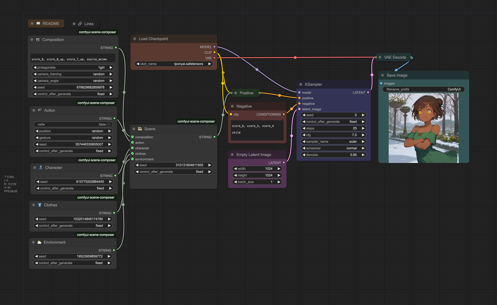

# ComfyUI Scene Composer

A collection of [ComfyUI](https://github.com/comfyanonymous/ComfyUI) nodes to create explicit NSFW scenes with random procedural generation.



## Installation

### Via ComfyUI

If you have [ComfyUI Manager](https://github.com/ltdrdata/ComfyUI-Manager) installed, you can simply import [`workflow.json`](workflow.json) or [`workflow.png`](workflow.png) in ComfyUI and click on "Install Missing Nodes".

Alternatively, you can install it via the [Comfy Registry](https://registry.comfy.org/publishers/taches/nodes/comfyui-scene-composer) using the [CLI](https://docs.comfy.org/comfy-cli/getting-started#install-cli).

```shell
$ comfy node registry-install comfyui-scene-composer
```

### Manually

Clone this repo in `custom_nodes` situated in your ComfyUI install folder.

```shell
$ git clone https://github.com/taches/comfyui-scene-composer
$ pip install -r requirements.txt
```

## Usage

The best way to gettint stat is to use the provided [`workflow.json`](workflow.json), which you can import in ComfyUI. You can play a bit with the parameters to see how they affect the generation.

You can check out the full NSFW workflow here: [civitai.com/models/579396](https://civitai.com/models/579396)

## About

### CivitAI links

- Author's profile: [civitai.com/user/taches](https://civitai.com/user/taches)
- Custom nodes page: [civitai.com/models/902456](https://civitai.com/models/902456/)
- Workflow page (NSFW): [civitai.com/models/579396](https://civitai.com/models/579396)

Don't hesitate to share your creations or text if you have questions and ideas of improvement.

### License

This project is licensed under the [MIT LICENSE](LICENSE)
